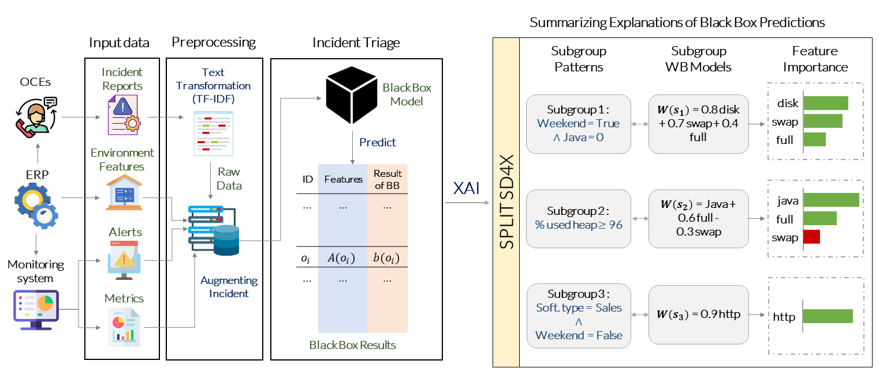

# SPLIT-SD4X: Interpretable Summaries of Black Box Incident Triaging with Subgroup Discovery

## OVERVIEW

In this [work](https://www.researchgate.net/publication/353776685_Interpretable_Summaries_of_Black_Box_Incident_Triaging_with_Subgroup_Discovery), we addressed the problem of Incident Triage to automatically triaging incidents of different natures. We propose an efficient black box model based on 170K user reported incidents that we dealt with over the last 7 years. This motivates our **contribution** which consists in an original approach that summarizes local explanations of black box predictions. Indeed, recent developments in explainable AI help in providing with global explanations on the model, but also, and most importantly, with local explanations for each model prediction. Unfortunately, providing a human with an understandable explanation for each outcome is not conceivable when dealing with an important number of daily predictions. To address this problem, our original method rooted in SD propose to conceptualize the predicted model outcomes into groups according to both a common description and the ability to locally mimic the black box model with a white box one.

## HOW TO CITE THIS PAPER ?

If you are using sd-4sql or our provided dataset for your research, please consider citing our paper:
        
    Y. Remil, A. Bendimerad, P. Marc, R. Céline, and M. Kaytoue, Interpretable summaries of black box incident triaging with subgroup discovery. in Proceedings of 8th IEEE International Conference on Data Science and Advanced Analytics (DSAA). IEEE, 2021.
    
bibtex:
  
    @inproceedings{remiletalDSAA21,
      title={Interpretable Summaries of Black Box Incident Triaging with Subgroup Discovery},
      author={Remil, Youcef and Bendimerad, Anes and Marc, Plantevit and Céline, Robardet and Kaytoue, Mehdi},
      booktitle={Proceedings of 8th IEEE International Conference on Data Science and Advanced Analytics (DSAA)},
      year={2021},
      organization={IEEE}
    }
